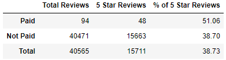

# Amazon_Vine_Analysis
Columbia Data Science Bootcamp Spark/AWS Module

## Deliverable 1
Data was extracted, transformed into the requested 4 DataFrames, and uploaded to AWS and pgAdmin.
### Screenshots of Each Table in pgAdmin
|                                                     |                                                   |
| --------------------------------------------------- | ------------------------------------------------- |
| customers_table                                     | products_table                                    |
|  |  |
| review_id_table                                     | vine_table                                        |
|  |          |

## Deliverable 2
Data was exported from pgAdmin into a `.csv` file, and from there was imported into a [Jupyter Notebook](Vine_Review_Analysis.ipynb) to be transformed with Pandas.
- Filtering was performed by the `.loc[]` function, e.g. `total20_df = games_df.loc[games_df['total_votes'] >= 20]`
- Counting rows was accomplished by accessing the first cell of the shape attribute, `.shape[0]`

## Deliverable 3
This Vine analysis was computed to determine if there is any bias in the review rating if the reviewer was paid (`vine == 'Y') or not.

### Summary Statistics

### How many Vine reviews and non-Vine reviews were there?
### How many Vine reviews were 5 stars? How many non-Vine reviews were 5 stars?
### What percentage of Vine reviews were 5 stars? What percentage of non-Vine reviews were 5 stars?
