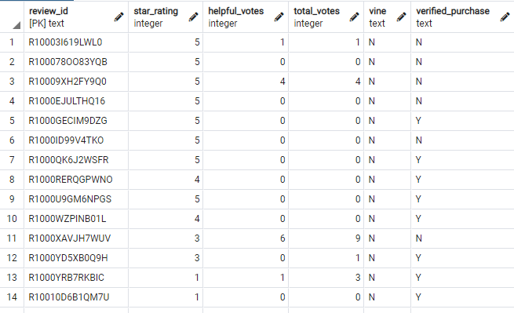

# Vine Analysis
Columbia Data Science Bootcamp Spark/AWS Module

## Deliverable 1
Data on reviews of video games was put into a [Google Colab Notebook](Amazon_Reviews_ETL.ipynb) and extracted, transformed into the requested 4 DataFrames, and uploaded to AWS and pgAdmin.

### Screenshots of Each Table in pgAdmin
|                                                     |                                                   |
| --------------------------------------------------- | ------------------------------------------------- |
| customers_table                                     | products_table                                    |
|  |  |
| review_id_table                                     | vine_table                                        |
|  |          |

## Deliverable 2
Data was exported from pgAdmin into a `.csv` file, and from there was imported into a [Jupyter Notebook](Vine_Review_Analysis.ipynb) to be transformed with Pandas.
- Filtering was performed by the `.loc[]` function, e.g. `total20_df = games_df.loc[games_df['total_votes'] >= 20]`
- Counting rows was accomplished by accessing the first cell of the shape attribute, `.shape[0]`

## Deliverable 3
This Vine analysis was computed to determine if there is any bias in the review rating if the reviewer was paid (`vine == 'Y') or not.

### Initial Selection
For this data, we will only be referring to reviews which have at least 20 total votes, with at least 50% of the votes considered "helpful" votes.  This will allow us to select reviews that are well reviewed and received by peers.

### Summary Statistics

#### How many Vine reviews and non-Vine reviews were there?
Of the reviews that meet our criteria, there were only 94 Vine reviews compared to 40471 non-Vine reviews.

#### How many Vine reviews were 5 stars? How many non-Vine reviews were 5 stars?
Of the Vine reviews, 48 of them were 5 stars, while 15663 of the non-Vine reviews were 5 stars.

#### What percentage of Vine reviews were 5 stars? What percentage of non-Vine reviews were 5 stars?
Of the Vine reviews, 51.06% of them were 5 stars, while 38.70% of the non-Vine reviews were 5 stars.

### Conclusions
If you only look at the percentages, it looks like there is a clear increase in the number of 5 star reviews coming from paid reviewers compared to unpaid reviewers.  However, there were only 94 Vine reviews that fit our criteria, so the power of any statistical correlation is likely less than it should be.

#### Additional Analyses
- A statistical test (such as a t-test) could provide better statistical significance to the difference between percentages that we see here.
- Especially with a small population, we should join tables and see if any of the paid (or unpaid) reviews were made by the same person (same `customer_id`).  It could be that only one or two reviewers are biased by their pay, and simply have reviewed a number of products to supplement their income, rather than the population as a whole.  This could also be done by examining the reviewers and their average scores, rather than the reviews themselves, to look for outliers.
